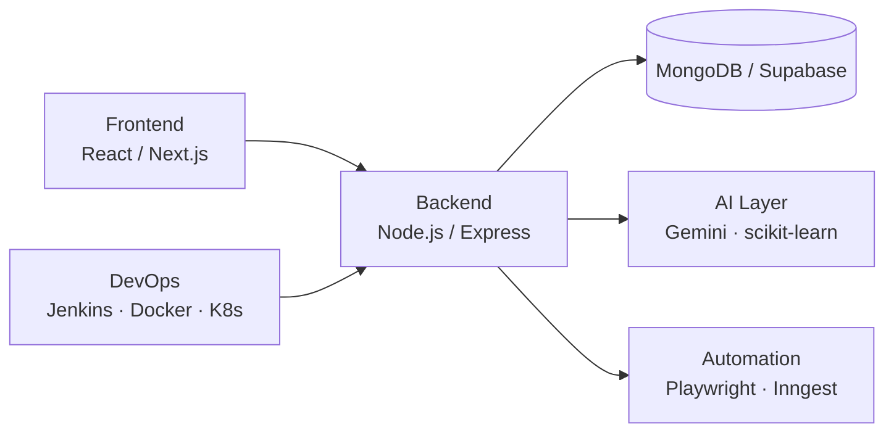

<div align="center">

# ⚡ SAKSHYA

### `full-stack engineer · ai/ml practitioner · b.tech cse @ vit bhopal`


[](https://animated-portfolio-tau-nine.vercel.app)
[](https://github.com/Sakshya10027)
[](https://leetcode.com)

</div>

---

## 01 — whoami

```txt
> Tech Lead, Virtual Reality & Gaming Club — VIT Bhopal
> Front-End Developer Intern — Uptricks
> 250+ LeetCode problems solved
> 18 public repos, most shipped and deployed within the last 3 months
> Currently building: hackathon-grade full-stack + ML tools, fast
```

---

## 02 — featured builds

| Project | What it does | Stack | Live |
|---|---|---|---|
| **[SEO Rank Tracker](https://github.com/Sakshya10027/SEO-Rank-Tracker)** | Full-stack SEO monitoring tool — headless keyword rank tracking + AI-generated audits | Playwright/Browserbase, Gemini 2.5 Flash, MongoDB, React 19, Node.js | [seo-rank-tracker-36tu.vercel.app](https://seo-rank-tracker-36tu.vercel.app) |
| **[MuleShield AI](https://github.com/Sakshya10027/Mule-Sheild)** | Fraud/mule-account detection ML system — built for Bank of India Cybersecurity Hackathon 2026 | Python, scikit-learn, Streamlit | [Live app](https://mule-sheild-ky8ignhwc2zmst8xjotx7c.streamlit.app) |
| **[EMS Platform](https://github.com/Sakshya10027/EMS-Platform)** | Full-stack HR system — RBAC, attendance, leave, payslip generation, background jobs | React, Node.js, Express, MongoDB, Inngest | [ems-platform-black.vercel.app](https://ems-platform-black.vercel.app) |
| **[Tourora](https://github.com/Sakshya10027/Tourora)** | Airbnb-style travel marketplace | Node.js, Express, MongoDB, EJS, Passport.js, Cloudinary | [tourora-7dot.onrender.com](https://tourora-7dot.onrender.com) |
| **[TaskZen](https://github.com/Sakshya10027/TaskZen)** | Real-time task manager with gamified XP system | Socket.IO, JWT, Google OAuth | [task-zen-three.vercel.app](https://task-zen-three.vercel.app) |
| **[SentiAI](https://github.com/Sakshya10027/SentiAI)** | Hackathon site for a behavioral-biometric authentication concept | JavaScript | — |
| **[CampusSync](https://github.com/Sakshya10027/CampusSync)** | Student coordination platform | Next.js 14, Supabase, Prisma, NextAuth | — |
| **[DevOps Pipeline](https://github.com/Sakshya10027/24BCY10027-DevOps-Project)** | Corporate website deployed through a full CI/CD pipeline | Jenkins, Docker, Kubernetes, Nagios, Grafana | — |

---

## 03 — system map



---

## 04 — github telemetry

<div align="center">


</div>

---

## 05 — stack

<div align="center">


</div>

---

## 06 — currently

```txt
> Refining FormCoach for hackathon submission (MediaPipe Pose, injury prevention)
> Standardizing READMEs across all repos with mermaid-heavy documentation
> Prepping for GATE CS 2027
```

<div align="center">


</div>
